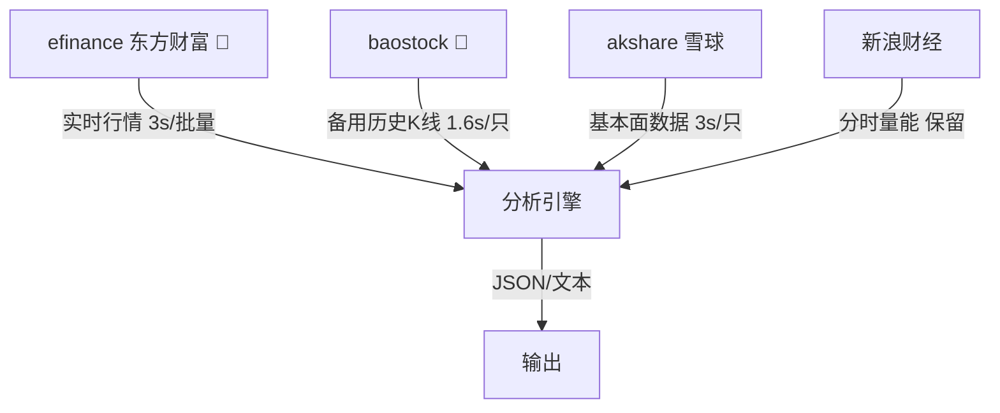

# A股实时行情与持仓管理 v2

多数据源融合主力 + 备胎 + 基本面全面覆盖。

## 数据源优先级



| 数据类型 | 主数据源 | 延迟 | 费用 | 备用 |
|---------|---------|:----:|:----:|------|
| 实时行情 | **efinance** (东方财富) | ~3s | 免费 | Sina (旧兼容) |
| 历史K线 | **efinance** (东方财富) | ~2s | 免费 | **baostock** ✅ |
| 基本面 | **akshare-雪球** 🆕 | ~3s | 免费 | — |
| 分时量能 | Sina (保留原实现) | ~1min | 免费 | — |

## 安装依赖

```bash
pip3 install efinance akshare baostock
```

## 脚本路径

所有脚本在 `{baseDir}/scripts/` 目录下：

```bash
# 实时行情（efinance 主力）
python3 {baseDir}/scripts/analyze.py 603778

# 实时行情 + 基本面（雪球）
python3 {baseDir}/scripts/analyze.py 603778 --fundamental

# 实时行情 + 基本面 + 分时量能
python3 {baseDir}/scripts/analyze.py 603778 --minute --fundamental

# 多只股票
python3 {baseDir}/scripts/analyze.py 603538 603778 002703 300342 000751 000890

# 历史K线（efinance → baostock fallback）
python3 {baseDir}/scripts/analyze.py --history 603538 --days 20

# JSON 输出
python3 {baseDir}/scripts/analyze.py 603538 603778 --json
```

### 持仓管理

```bash
python3 {baseDir}/scripts/portfolio.py show                    # 显示持仓
python3 {baseDir}/scripts/portfolio.py show --json              # JSON输出
python3 {baseDir}/scripts/portfolio.py add 603778 --cost 26.5 --qty 1000
python3 {baseDir}/scripts/portfolio.py update 603778 --cost 27.0
python3 {baseDir}/scripts/portfolio.py remove 603778
python3 {baseDir}/scripts/portfolio.py analyze                  # PnL分析（含分时，稍慢）
python3 {baseDir}/scripts/portfolio.py analyze --json            # JSON输出
```

## 功能详解

### 实时行情（efinance）

比 Sina 多 3 倍字段量：

- 现价、涨跌、涨跌幅、昨收
- 今开、最高、最低、换手率、量比
- **动态市盈率**、**总市值**、**流通市值**
- **批量一次取**（6只 ~3s 搞定）

### 基本面数据（akshare-雪球）

```json
{
  "动态PE": 101.85, "静态PE": 124.19,
  "PB": 5.50, "TTM股息率": 0.09%,
  "每股收益": 0.51, "每股净资产": 10.48,
  "52周最高": 59.40, "52周最低": 13.31,
  "今年以来涨幅": 199.27%
}
```

### 历史K线（efinance → baostock 双保险）

- 主：efinance（东方财富，JSON）
- 备：**baostock**（从意大利可直连 ✅）
- 数据格式统一：date/open/high/low/close/volume/amount/change_pct

### 分时量能分析

保留新浪分钟K线接口（efinance 不提供分钟级数据），分析：
- 早盘30分抢筹信号 (>30% → 主力抢筹, >40% → 强势介入)
- 尾盘异动信号 (>15% → 放量, >25% → 抢筹/出货)
- 放量时段 TOP 10

### 持仓管理

JSON 文件 `~/.openclaw/data/portfolio.json`，支持：
- 自动获取实时行情计算 PnL
- `--json` 输出给 AI cron 消费
- 自动更新股票名称

## 输出示例（新格式）

```
============================================================
股票: 美诺华 (603538)
============================================================

【实时行情】
  现价: 57.58  涨跌: +3.65%
  今开: 55.00  最高: 59.40  最低: 54.10
  昨收: 55.55  换手: 26.41%
  成交量: 59.4万手  成交额: 33.97亿
  市盈率: 105.8  量比: 1.05
  总市值: 131.9亿  流通市值: 129.4亿
  数据源: efinance

  【基本面数据】
    动态PE: 101.85  静态PE: 124.19
    市净率: 5.50  TTM股息率: 0.09%
    每股收益: 0.5100  每股净资产: 10.48
    52周最高: 59.40  52周最低: 13.31
    振幅: 9.54%  今年以来: 199.27%
  数据源: xueqiu
```

## Cron 定时任务

与之前一致，北京时间交易日 4 次推送。

## 数据源选择说明

从意大利（欧洲）测试结论：

| 数据源 | 实时 | 历史 | 基本面 | 意大利可用 | 推荐度 |
|-------|:----:|:----:|:------:|:---------:|:-----:|
| **efinance** | ✅ | ✅ | — | ✅ 畅通 | ⭐⭐⭐⭐⭐ |
| **baostock** | — | ✅ | — | ✅ 畅通 | ⭐⭐⭐⭐ |
| **akshare-雪球** | ✅ | — | ✅ | ✅ 畅通 | ⭐⭐⭐ |
| akshare-东财 | ❌ | ✅ | — | ❌ 封IP | ⭐ |
| pytdx | ✅ | ✅ | — | ❌ 封IP | ❌ |
| Sina (旧) | ✅ | — | — | ✅ | ⭐⭐(过渡) |

## 限制

- 仅 A 股（沪深北交所），不含港股/美股
- efinance 历史K线从意大利有时被东方财富重置，自动切换到 baostock
- 新浪分时接口在非交易时段返回缓存数据
- 非交易时段使用 `--fundamental` 是好选择（基本面数据不依赖实时）
